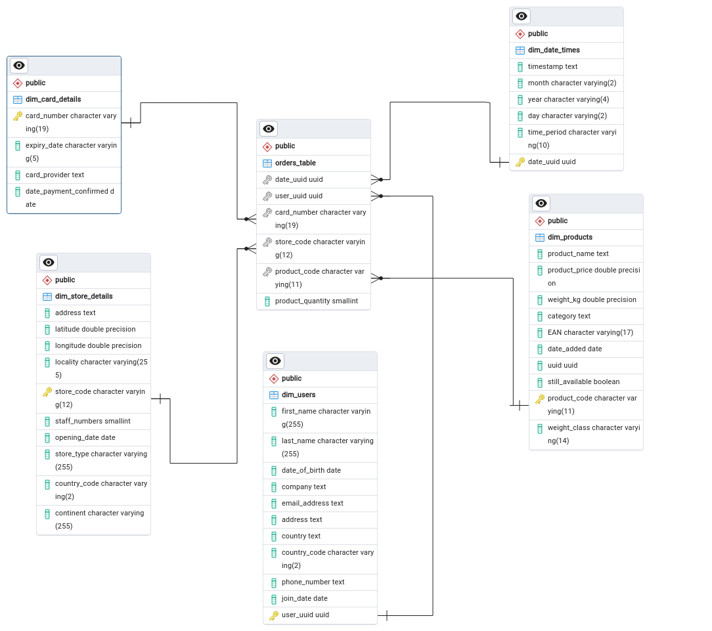

# Multinational Retail Data Centralisation

A data engineering project to automate data extraction, cleaning and uploading to a PSQL database for querying. The project explores extraction and cleaning of multiple datatypes from multiple sources, including AWS RDS databases, PDF files, S3 buckets, and APIs.

## Description

> You work for a multinational company that sells various goods across the globe. <br>
> Currently, their sales data is spread across many different data sources making it not easily accessible or analysable by current members of the team. <br>
> In an effort to become more data-driven, your organisation would like to make its sales data accessible from one centralised location.<br>
> Your first goal will be to produce a system that stores the current company data in a database so that it's accessed from one centralised location and acts as a single source of truth for sales data.<br>
> You will then query the database to get up-to-date metrics for the business.

The learning goals for this project are:

- To devise a custom ETL (extract, transform, load) pipeline
- Become familiar with data cleaning using the Pandas library for Python
- Develop skills with PSQL

## Installation

### Prerequisites:

- Python v3.12
- PostgreSQL v14.12 or higher
- pgAdmin4 v6.9 or higher

In your terminal:

```
$ git clone https://github.com/ArachnaDude/multinational-retail-data-centralisation140.git
$ cd multinational-retail-data-centralisation140
```

For a full list of requirements for the project, check the `requirements.txt` file in the project's root directory.

Use the commands:

```
$ conda create --name <env_name> --file requirements.txt
$ conda activate <env_name>
```

## Usage

### Python

---

#### Main Components:

The Python part of this project is comprised of 3 classes:

- **DatabaseConnector**: Handles the connections to databases
- **DataExtractor**: Handles the extraction of data from various sources
- **DataCleaning**: Handles the cleaning of extracted data

#### Configuration:

The following files are required for successful running of the project. Due to the sensitive content, private distrubtion is for contributors only.

- **db_creds.yaml**: credentials for the remote database
- **local_creds.yaml**: credentials for the local database
- **pdf_link.yaml**: path to the PDF
- **api_creds.yaml**: credentials for the API
- **s3_path.yaml**: path to the S3 bucket
- **s3_path2.yaml**: path to the second S3 bucket

### Running:

To run this project, simply run `main.py`. Make sure your working directory is the MRDC project.

```
$ python3 main.py
```

`main.py` collects all of the functions that govern the ETL pipeline for each table. As such, running it will extract, clean and upload all tables to the local database.

### PSQL

---

#### Schema setup:

The Python functions govern the upload of the cleaned data. However the next step is to set up the schema for the database. This is to be done inside pgAdmin4.

The query files inside the `sql_queries/` directory will handle this, and should be executed in the following order:

- Running the query files in the `cast_column_types/` sub-directory will convert the columns in each table to the correct datatype.

- Running the query file in the `set_primary_keys/` sub-directory will set the primary keys for each table.

- Running the query file in the `set_foreign_keys/` subdirectory will set the foreign keys on the orders_table that reference the primary keys for the other tables.

The result of this should be a database with the following relationships:



The `sales_data` database is now ready to be queried.
